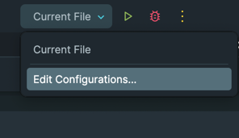
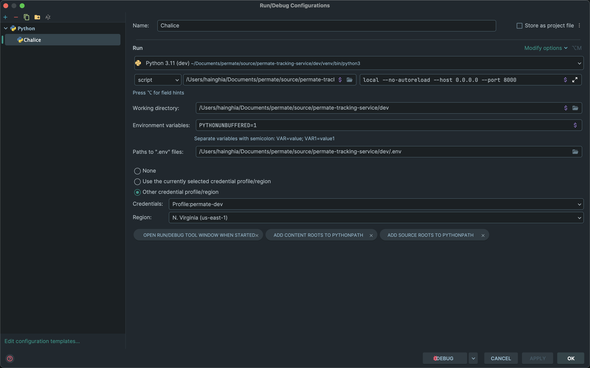

# Debug Idea

## Cài đặt Debug Chalice trên `pycharm`

- https://github.com/aws/chalice/issues/548
- https://github.com/aws/chalice/issues/873

1. Mở PyCharm và mở project Chalice.
2. Tạo một cấu hình mới cho việc chạy và debug. Nhấp vào menu "Run" trên thanh công cụ, chọn "Edit Configurations...".
   
3. Trong cửa sổ cấu hình, nhấp vào biểu tượng "+" ở góc trên bên trái và chọn "Python".
   Đặt tên cho cấu hình, ví dụ: "Chalice Debug".
   Trong phần "Script path", điều chỉnh đường dẫn đến file /venv/bin/chalice trong project của bạn.
   Trong phần "Parameters", điền các thông số như hình
    ```shell
    local --no-autoreload --host 0.0.0.0 --port 8000
    ```
    